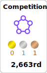

### Hi there 👋
    I’m currently intrested in NLP
🌱 I’m currently learning more about LLMs (RAG, different prompting techniques, conversational models)   
📫 How to reach me: 
- email: dyushakolesov@mail.ru 
- telegram: @vladislav_kol  
💬 Additional links:
- kaggle: https://www.kaggle.com/vladislavkolesov  
<!--
**vladislav3112/vladislav3112** is a ✨ _special_ ✨ repository because its `README.md` (this file) appears on your GitHub profile.

Here are some ideas to get you started:

- 🔭 I’m currently working on ...
- 🌱 I’m currently learning ...
- 👯 I’m looking to collaborate on ...
- 🤔 I’m looking for help with ...
- 💬 Ask me about ...
- 📫 How to reach me: ...
- 😄 Pronouns: ...
- ⚡ Fun fact: ...
-->

